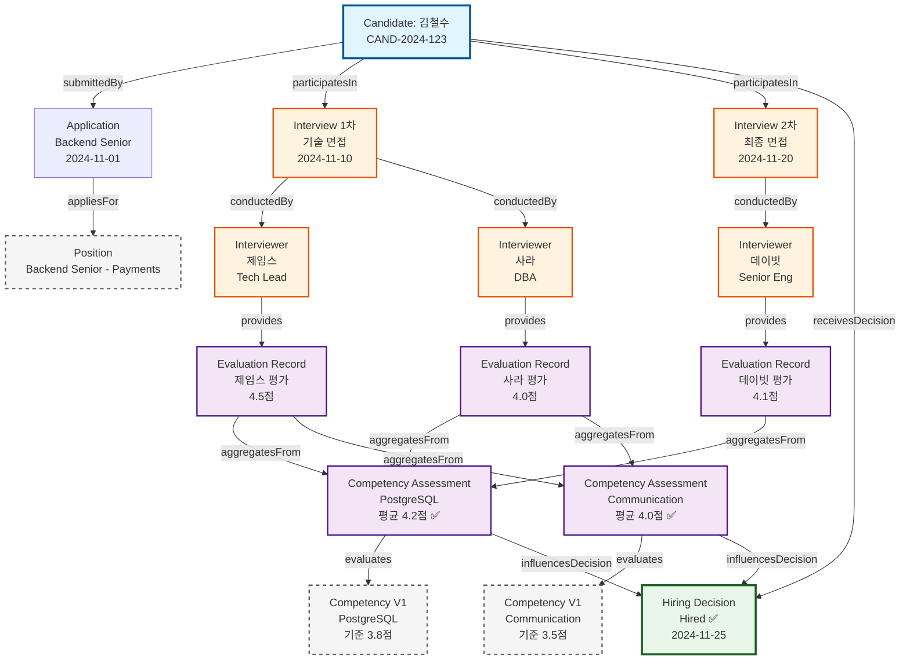

# V1.5 지식 그래프 (Knowledge Graph)

**작성일:** 2025-11-28
**작성자:** Terry
**버전:** v1.0.0
**상태:** 완료

---

## 📋 개요

V1.5 동적 개념을 지식 그래프로 표현하여 개념 간 관계를 시각적으로 탐색하고, 그래프 쿼리를 통해 복잡한 DCQ를 해결합니다.

**지식 그래프의 장점:**
- 개념 간 다층 관계 탐색 (Traversal)
- 패턴 발견 (Pattern Matching)
- 추론 (Inference)
- 시각적 탐색 (Visual Exploration)

---

## 🌐 Method 1: Mermaid 다이어그램

### 전체 지식 그래프 (ER 다이어그램)



---

### 특정 후보자 중심 그래프 (Graph 형태)



---

## 🗄️ Method 2: Neo4j Cypher (그래프 DB)

### 스키마 생성 (Cypher)

```cypher
// ==========================================
// V1 정적 개념 생성
// ==========================================

// Position 생성
CREATE (pos:Position {
  positionID: 'POS-BE-SR-001',
  title: 'Backend Senior - Payments',
  jobLevel: 'Senior',
  department: 'Engineering'
})

// Competency 생성 (V1)
CREATE (comp_pg:Competency {
  competencyID: 'COMP-002',
  name: 'PostgreSQL Database Design & Optimization',
  category: 'Technical',
  passingThreshold: 3.8
})

CREATE (comp_comm:Competency {
  competencyID: 'COMP-010',
  name: 'Communication & Collaboration',
  category: 'Soft Skill',
  passingThreshold: 3.5
})

// ==========================================
// V1.5 동적 개념 생성 - Candidate Journey
// ==========================================

// Candidate 생성
CREATE (cand:Candidate {
  candidateID: 'CAND-2024-123',
  name: '김철수',
  email: 'kim@example.com',
  experienceYears: 7
})

// Application 생성
CREATE (app:Application {
  applicationID: 'APP-2024-001',
  candidateID: 'CAND-2024-123',
  positionID: 'POS-BE-SR-001',
  appliedDate: datetime('2024-11-01T09:00:00Z'),
  status: 'Hired',
  source: 'LinkedIn'
})

// Interview Stage 생성
CREATE (stage1:InterviewStage {
  stageID: 'STAGE-001',
  stageName: '1차 기술 면접',
  stageOrder: 1,
  stageType: 'Technical'
})

CREATE (stage2:InterviewStage {
  stageID: 'STAGE-002',
  stageName: '2차 최종 면접',
  stageOrder: 2,
  stageType: 'Behavioral'
})

// Interview 생성
CREATE (int1:Interview {
  interviewID: 'INT-2024-001',
  candidateID: 'CAND-2024-123',
  interviewDate: datetime('2024-11-10T14:00:00Z'),
  duration: 90,
  format: 'Video'
})

CREATE (int2:Interview {
  interviewID: 'INT-2024-002',
  candidateID: 'CAND-2024-123',
  interviewDate: datetime('2024-11-20T10:00:00Z'),
  duration: 60,
  format: 'In-person'
})

// Lead Time 생성
CREATE (lt1:LeadTime {
  leadTimeID: 'LT-001',
  fromStage: 'Application',
  toStage: '1차 면접',
  durationDays: 9
})

CREATE (lt2:LeadTime {
  leadTimeID: 'LT-002',
  fromStage: '1차 면접',
  toStage: '2차 면접',
  durationDays: 10
})

// ==========================================
// V1.5 동적 개념 생성 - Evaluation
// ==========================================

// Interviewer 생성
CREATE (james:Interviewer {
  interviewerID: 'james@company.com',
  name: 'James Lee',
  department: 'Engineering',
  role: 'Backend Tech Lead',
  avgEvaluationScore: 4.0,
  leniencyScore: 0.4
})

CREATE (sarah:Interviewer {
  interviewerID: 'sarah@company.com',
  name: 'Sarah Chen',
  department: 'Engineering',
  role: 'DBA',
  avgEvaluationScore: 3.4,
  leniencyScore: -0.2
})

CREATE (david:Interviewer {
  interviewerID: 'david@company.com',
  name: 'David Kim',
  department: 'Engineering',
  role: 'Senior Engineer',
  avgEvaluationScore: 3.6,
  leniencyScore: 0.0
})

// Evaluation Record 생성
CREATE (er1:EvaluationRecord {
  recordID: 'ER-2024-001',
  interviewID: 'INT-2024-001',
  candidateID: 'CAND-2024-123',
  interviewerID: 'james@company.com',
  overallScore: 4.5,
  recommendation: 'Strong Hire',
  evaluationDate: datetime('2024-11-10T16:30:00Z')
})

CREATE (er2:EvaluationRecord {
  recordID: 'ER-2024-002',
  interviewID: 'INT-2024-001',
  candidateID: 'CAND-2024-123',
  interviewerID: 'sarah@company.com',
  overallScore: 4.0,
  recommendation: 'Hire',
  evaluationDate: datetime('2024-11-10T16:45:00Z')
})

CREATE (er3:EvaluationRecord {
  recordID: 'ER-2024-003',
  interviewID: 'INT-2024-002',
  candidateID: 'CAND-2024-123',
  interviewerID: 'david@company.com',
  overallScore: 4.1,
  recommendation: 'Hire',
  evaluationDate: datetime('2024-11-20T12:00:00Z')
})

// Competency Assessment 생성
CREATE (ca_pg:CompetencyAssessment {
  assessmentID: 'CA-2024-001',
  candidateID: 'CAND-2024-123',
  competencyID: 'COMP-002',
  averageScore: 4.2,
  evaluationCount: 3,
  scoreVariance: 0.25,
  confidenceLevel: 'High',
  isPassing: true
})

CREATE (ca_comm:CompetencyAssessment {
  assessmentID: 'CA-2024-002',
  candidateID: 'CAND-2024-123',
  competencyID: 'COMP-010',
  averageScore: 4.0,
  evaluationCount: 3,
  scoreVariance: 0.3,
  confidenceLevel: 'High',
  isPassing: true
})

// ==========================================
// V1.5 동적 개념 생성 - Outcome
// ==========================================

// Hiring Decision 생성
CREATE (hd:HiringDecision {
  decisionID: 'HD-2024-001',
  candidateID: 'CAND-2024-123',
  positionID: 'POS-BE-SR-001',
  decision: 'Hired',
  decisionDate: datetime('2024-11-25T09:00:00Z'),
  primaryReason: 'Strong technical skills across all competencies',
  detailedNotes: 'PostgreSQL 4.2, Communication 4.0 - excellent fit for Payments team'
})

// ==========================================
// 관계 생성 (R-003 ~ R-006)
// ==========================================

// R-003: Candidate → Application → Position
MATCH (c:Candidate {candidateID: 'CAND-2024-123'})
MATCH (a:Application {applicationID: 'APP-2024-001'})
MATCH (p:Position {positionID: 'POS-BE-SR-001'})
CREATE (c)-[:SUBMITTED]->(a)
CREATE (a)-[:APPLIES_FOR]->(p)

// R-003: Candidate → Interview
MATCH (c:Candidate {candidateID: 'CAND-2024-123'})
MATCH (i1:Interview {interviewID: 'INT-2024-001'})
MATCH (i2:Interview {interviewID: 'INT-2024-002'})
CREATE (c)-[:PARTICIPATES_IN]->(i1)
CREATE (c)-[:PARTICIPATES_IN]->(i2)

// R-003: Interview → Interviewer
MATCH (i1:Interview {interviewID: 'INT-2024-001'})
MATCH (james:Interviewer {interviewerID: 'james@company.com'})
MATCH (sarah:Interviewer {interviewerID: 'sarah@company.com'})
CREATE (i1)-[:CONDUCTED_BY]->(james)
CREATE (i1)-[:CONDUCTED_BY]->(sarah)

MATCH (i2:Interview {interviewID: 'INT-2024-002'})
MATCH (david:Interviewer {interviewerID: 'david@company.com'})
CREATE (i2)-[:CONDUCTED_BY]->(david)

// R-003: Interview → Evaluation Record
MATCH (i1:Interview {interviewID: 'INT-2024-001'})
MATCH (er1:EvaluationRecord {recordID: 'ER-2024-001'})
MATCH (er2:EvaluationRecord {recordID: 'ER-2024-002'})
CREATE (i1)-[:PRODUCES]->(er1)
CREATE (i1)-[:PRODUCES]->(er2)

MATCH (i2:Interview {interviewID: 'INT-2024-002'})
MATCH (er3:EvaluationRecord {recordID: 'ER-2024-003'})
CREATE (i2)-[:PRODUCES]->(er3)

// R-003: Interviewer → Evaluation Record
MATCH (james:Interviewer {interviewerID: 'james@company.com'})
MATCH (er1:EvaluationRecord {recordID: 'ER-2024-001'})
CREATE (james)-[:PROVIDES]->(er1)

MATCH (sarah:Interviewer {interviewerID: 'sarah@company.com'})
MATCH (er2:EvaluationRecord {recordID: 'ER-2024-002'})
CREATE (sarah)-[:PROVIDES]->(er2)

MATCH (david:Interviewer {interviewerID: 'david@company.com'})
MATCH (er3:EvaluationRecord {recordID: 'ER-2024-003'})
CREATE (david)-[:PROVIDES]->(er3)

// R-004: Evaluation Record → Competency Assessment
MATCH (er1:EvaluationRecord {recordID: 'ER-2024-001'})
MATCH (er2:EvaluationRecord {recordID: 'ER-2024-002'})
MATCH (er3:EvaluationRecord {recordID: 'ER-2024-003'})
MATCH (ca_pg:CompetencyAssessment {assessmentID: 'CA-2024-001'})
MATCH (ca_comm:CompetencyAssessment {assessmentID: 'CA-2024-002'})
CREATE (er1)-[:AGGREGATES_FROM {competency: 'PostgreSQL', score: 4.5}]->(ca_pg)
CREATE (er2)-[:AGGREGATES_FROM {competency: 'PostgreSQL', score: 4.0}]->(ca_pg)
CREATE (er3)-[:AGGREGATES_FROM {competency: 'PostgreSQL', score: 4.1}]->(ca_pg)
CREATE (er1)-[:AGGREGATES_FROM {competency: 'Communication', score: 4.2}]->(ca_comm)
CREATE (er2)-[:AGGREGATES_FROM {competency: 'Communication', score: 3.8}]->(ca_comm)
CREATE (er3)-[:AGGREGATES_FROM {competency: 'Communication', score: 4.0}]->(ca_comm)

// R-005: Competency Assessment → Competency (V1)
MATCH (ca_pg:CompetencyAssessment {assessmentID: 'CA-2024-001'})
MATCH (ca_comm:CompetencyAssessment {assessmentID: 'CA-2024-002'})
MATCH (comp_pg:Competency {competencyID: 'COMP-002'})
MATCH (comp_comm:Competency {competencyID: 'COMP-010'})
CREATE (ca_pg)-[:EVALUATES]->(comp_pg)
CREATE (ca_comm)-[:EVALUATES]->(comp_comm)

// R-006: Competency Assessment → Hiring Decision
MATCH (ca_pg:CompetencyAssessment {assessmentID: 'CA-2024-001'})
MATCH (ca_comm:CompetencyAssessment {assessmentID: 'CA-2024-002'})
MATCH (hd:HiringDecision {decisionID: 'HD-2024-001'})
CREATE (ca_pg)-[:INFLUENCES_DECISION {weight: 0.6}]->(hd)
CREATE (ca_comm)-[:INFLUENCES_DECISION {weight: 0.4}]->(hd)

// Candidate → Hiring Decision
MATCH (c:Candidate {candidateID: 'CAND-2024-123'})
MATCH (hd:HiringDecision {decisionID: 'HD-2024-001'})
CREATE (c)-[:RECEIVES_DECISION]->(hd)
```

---

### DCQ 쿼리 예시 (Cypher)

#### DCQ-01: 리드타임 계산

```cypher
// 후보자별 평균 리드타임 (지원 → 최종 결정)
MATCH (c:Candidate)-[:SUBMITTED]->(a:Application)
MATCH (c)-[:RECEIVES_DECISION]->(hd:HiringDecision)
WHERE hd.decision = 'Hired'
RETURN
  c.name,
  duration.between(a.appliedDate, hd.decisionDate).days AS lead_time_days,
  AVG(duration.between(a.appliedDate, hd.decisionDate).days) AS avg_lead_time
```

---

#### DCQ-04: 면접관 패턴 분석

```cypher
// 면접관별 평가 평균 및 관대함 지수
MATCH (interviewer:Interviewer)-[:PROVIDES]->(er:EvaluationRecord)
WITH interviewer, AVG(er.overallScore) AS interviewer_avg
MATCH (er2:EvaluationRecord)
WITH interviewer, interviewer_avg, AVG(er2.overallScore) AS overall_avg
RETURN
  interviewer.name,
  interviewer.department,
  ROUND(interviewer_avg, 2) AS avg_score,
  ROUND(interviewer_avg - overall_avg, 2) AS leniency_score
ORDER BY leniency_score DESC
```

---

#### DCQ-05: 합격자 벤치마크

```cypher
// 합격자의 역량별 평균 점수
MATCH (c:Candidate)-[:RECEIVES_DECISION]->(hd:HiringDecision)
WHERE hd.decision = 'Hired'
MATCH (c)-[:SUBMITTED]->(:Application)
      -[:APPLIES_FOR]->(p:Position)
MATCH (ca:CompetencyAssessment {candidateID: c.candidateID})
      -[:EVALUATES]->(comp:Competency)
RETURN
  p.title AS position,
  comp.name AS competency,
  ROUND(AVG(ca.averageScore), 2) AS avg_score,
  MIN(ca.averageScore) AS min_score,
  MAX(ca.averageScore) AS max_score,
  COUNT(*) AS sample_size
ORDER BY avg_score DESC
```

---

#### DCQ-06: Pass/Fail 기준점 발견

```cypher
// Communication 점수별 합격률
MATCH (ca:CompetencyAssessment)-[:EVALUATES]->
      (comp:Competency {name: 'Communication & Collaboration'})
MATCH (c:Candidate {candidateID: ca.candidateID})
      -[:RECEIVES_DECISION]->(hd:HiringDecision)
WITH
  CASE
    WHEN ca.averageScore < 3.0 THEN 'Below 3.0'
    WHEN ca.averageScore < 3.5 THEN '3.0-3.5'
    WHEN ca.averageScore < 4.0 THEN '3.5-4.0'
    ELSE '4.0+'
  END AS score_range,
  hd.decision
WITH score_range, COUNT(*) AS total,
     SUM(CASE WHEN decision = 'Hired' THEN 1 ELSE 0 END) AS hired
RETURN
  score_range,
  total,
  hired,
  ROUND(100.0 * hired / total, 1) AS hire_rate_pct
ORDER BY score_range
```

---

#### DCQ-07: 탈락 사유 Top 3

```cypher
// 기준 미달 역량별 탈락 건수
MATCH (c:Candidate)-[:RECEIVES_DECISION]->(hd:HiringDecision)
WHERE hd.decision = 'Rejected'
MATCH (ca:CompetencyAssessment {candidateID: c.candidateID})
      -[:EVALUATES]->(comp:Competency)
WHERE ca.isPassing = false
RETURN
  comp.name AS competency,
  COUNT(*) AS rejection_count,
  ROUND(AVG(ca.averageScore), 2) AS avg_score,
  comp.passingThreshold,
  ROUND(100.0 * COUNT(*) / (
    SELECT COUNT(*) FROM HiringDecision WHERE decision = 'Rejected'
  ), 1) AS rejection_rate_pct
ORDER BY rejection_count DESC
LIMIT 3
```

---

#### DCQ-08: 예외 케이스 분석 (PostgreSQL 우수하나 탈락)

```cypher
// PostgreSQL 4.0점 이상인데 탈락한 케이스
MATCH (c:Candidate)-[:RECEIVES_DECISION]->(hd:HiringDecision)
WHERE hd.decision = 'Rejected'
MATCH (ca_pg:CompetencyAssessment {candidateID: c.candidateID})
      -[:EVALUATES]->(comp_pg:Competency {name: 'PostgreSQL Database Design & Optimization'})
WHERE ca_pg.averageScore >= 4.0
OPTIONAL MATCH (ca_other:CompetencyAssessment {candidateID: c.candidateID})
               -[:EVALUATES]->(comp_other:Competency)
WHERE ca_other.isPassing = false
RETURN
  c.name,
  ca_pg.averageScore AS postgresql_score,
  COLLECT(comp_other.name) AS failing_competencies,
  COLLECT(ca_other.averageScore) AS failing_scores,
  hd.primaryReason
ORDER BY ca_pg.averageScore DESC
```

---

### 그래프 탐색 쿼리 (패턴 발견)

#### 패턴 1: 면접관 → 합격자 연결

```cypher
// 제임스가 평가한 후보자 중 합격한 사람들의 특징
MATCH (james:Interviewer {name: 'James Lee'})
      -[:PROVIDES]->(er:EvaluationRecord)
      -[:AGGREGATES_FROM]->(ca:CompetencyAssessment)
MATCH (c:Candidate {candidateID: ca.candidateID})
      -[:RECEIVES_DECISION]->(hd:HiringDecision {decision: 'Hired'})
MATCH (ca)-[:EVALUATES]->(comp:Competency)
RETURN
  comp.name,
  AVG(ca.averageScore) AS avg_score,
  COUNT(*) AS hired_count
ORDER BY avg_score DESC
```

---

#### 패턴 2: 다층 추론 (3-hop)

```cypher
// Position → Candidate → Competency Assessment → Competency (3단계 추론)
MATCH path = (pos:Position)
  <-[:APPLIES_FOR]-(:Application)
  <-[:SUBMITTED]-(c:Candidate)
  -[:RECEIVES_DECISION]->(hd:HiringDecision {decision: 'Hired'})
MATCH (ca:CompetencyAssessment {candidateID: c.candidateID})
      -[:EVALUATES]->(comp:Competency)
WITH pos, comp, AVG(ca.averageScore) AS avg_score
RETURN
  pos.title AS position,
  comp.name AS required_competency,
  ROUND(avg_score, 2) AS success_threshold
ORDER BY position, avg_score DESC
```

---

## 🎨 시각화 도구 추천

### Neo4j Browser
- Neo4j Desktop 설치 후 위 Cypher 스크립트 실행
- 자동 시각화 (노드 색상, 관계 표시)
- 인터랙티브 탐색 가능

### Bloom (Neo4j)
- 비개발자도 그래프 탐색 가능
- 자연어 쿼리 지원
- "김철수의 채용 여정을 보여줘" → 자동 시각화

### Graphviz
- DOT 언어로 변환 후 PNG/SVG 생성
- CI/CD 파이프라인에 통합 가능

---

## 📊 그래프 메트릭스

### 노드 통계

```cypher
// 노드 타입별 개수
MATCH (n)
RETURN labels(n) AS node_type, COUNT(*) AS count
ORDER BY count DESC
```

### 관계 통계

```cypher
// 관계 타입별 개수
MATCH ()-[r]->()
RETURN type(r) AS relationship_type, COUNT(*) AS count
ORDER BY count DESC
```

### 중심성 분석 (Centrality)

```cypher
// 가장 많은 관계를 가진 노드 (Degree Centrality)
MATCH (n)
RETURN labels(n)[0] AS type, n.name AS name,
       size((n)--()) AS degree
ORDER BY degree DESC
LIMIT 10
```

---

## 🚀 실제 구현 가이드

### Step 1: Neo4j 설치

```bash
# Neo4j Desktop 다운로드 (권장)
https://neo4j.com/download/

# 또는 Docker
docker run -d \
  --name neo4j-hr-ontology \
  -p 7474:7474 -p 7687:7687 \
  -e NEO4J_AUTH=neo4j/password \
  neo4j:latest
```

### Step 2: 데이터 임포트

```cypher
// 위의 전체 Cypher 스크립트를 Neo4j Browser에서 실행
// 또는 파일로 저장 후 실행
:source /path/to/schema.cypher
```

### Step 3: DCQ 쿼리 테스트

```cypher
// DCQ-05 실행
MATCH (c:Candidate)-[:RECEIVES_DECISION]->(hd:HiringDecision)
WHERE hd.decision = 'Hired'
MATCH (ca:CompetencyAssessment {candidateID: c.candidateID})
      -[:EVALUATES]->(comp:Competency)
RETURN comp.name, AVG(ca.averageScore) AS avg_score
```

---

## 🔗 관련 문서

- [통합 관계 다이어그램](./dynamic-relationships.md)
- [R-003~R-006 관계 정의](./r-003-to-r-006-summary.md)
- [동적 개념 리스트](../concepts/dynamic-concepts-list.md)

---

## 📝 변경 이력

| 날짜 | 변경 내용 | 변경자 | 이유 |
|------|----------|--------|------|
| 2025-11-28 | 지식 그래프 초안 작성 (Mermaid + Neo4j) | Terry | 시각적 탐색 및 그래프 쿼리 지원 |

---

*이 지식 그래프는 V1.5 동적 개념을 시각적으로 탐색하고, DCQ를 그래프 쿼리로 해결하기 위한 구현 가이드입니다.*
